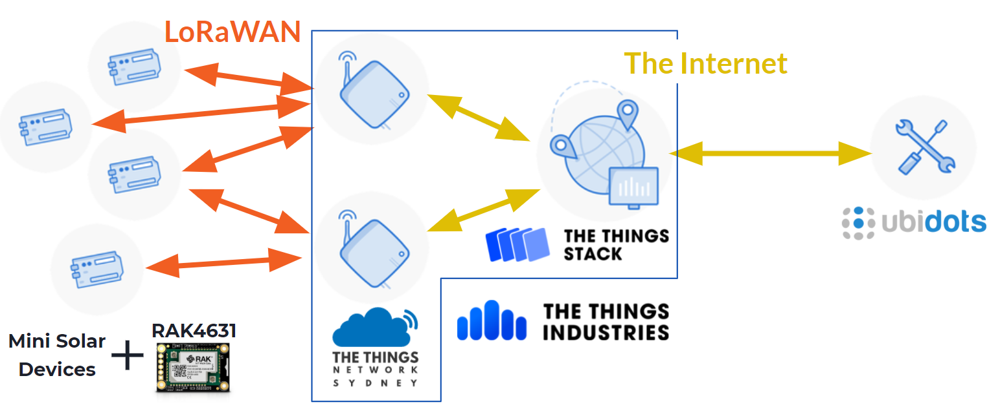

# Mini Solar UNSW LoRaWAN Project

This repo contains all the files associated with the Mini Solar LoRaWAN Prototype Project:

- [Ubidots](./Ubidots/) documentation & associated [payload decoder](./Ubidots/PayloadDecoder/) function
- [The Things Stack (TTS)](./TheThingsStack/) documentation & [bulk device creation](./TheThingsStack/#bulk-device-creation) command-line tool
- [WisBlock Firmware](https://github.com/minisolarunsw/WisBlockDataloggerFirmware) developed for the Rak LoRaWAN devices

  - [Mini Solar device firmware](https://github.com/minisolarunsw/WisBlockDataloggerFirmware/tree/main/examples/Combined_lib_example/) - The example combines the three libraries and is a good leaping off point for further firmware development

  test commit
