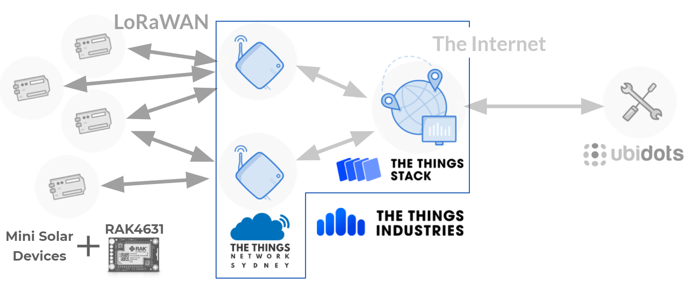

# The Things Stack (TTS) Documentation

## Overview

[TTS Community Edition](https://au1.cloud.thethings.network/console/) is a free LoRaWAN Network Server that allows end LoRaWAN nodes to connect to an open community network and forward data packets onto other web applications.

## Applications

Applications are the device side of TTS. Each application is a collection of devices that can use the same payload formatters and integration(s) to forward data into external web apps.

### Adding a device

The RAK WisBlock devices are not part of the LoRaWAN Device Repository so they have to be added manually. Please refer to [this](https://www.thethingsindustries.com/docs/devices/adding-devices/#manually-registering-an-end-device) guide from TTS on doing so.

The input parameters for the RAK4630 are:

| Parameter                         | Input                                                                                                                   |
| --------------------------------- | ----------------------------------------------------------------------------------------------------------------------- |
| LoRaWAN version                   | MAC V1.0.2                                                                                                              |
| Regional Parameters version       | PHY V1.0.2 REV B                                                                                                        |
| Frequency Plan                    | Australia 915-928 MHz, FSB 2 (used by TTN)                                                                              |
| DevEUI\*               | 16 digit hexidecimal number found on RAK4630 (also given by the QR code)                                                |
| AppEUI\* (AKA JoinEUI) | 16 digit hexidecimal number ([cannot be all zeros](https://forum.rakwireless.com/t/rak7200-join-fails/3572) on RAK4630) |
| AppKey\*               | Generate the 32 digit hexidecimal number                                                                                |
| End device ID^         | A unique, human-readable identifier e.g. "mini-solar-device-1"                                                          |

\* Save these values to be used by device in firmware.

^ This will be [used by Ubidots as the device label](./UbidotsDocumentation.md#device-creation) so choose wisely.

#### Bulk Device Creation

Alternatively devices can be created in bulk by selecting "Import end devices". Then set the format to "The Things Stack JSON" and upload a `devices.json` file of the [correct format](https://www.thethingsindustries.com/docs/getting-started/migrating/device-json/).

To make this easier I've included a simple python command-line tool that converts a csv to a json of the correct TTS format, plus a csv template for it.
The template includes the basic parameters required to create a device in TTS, but you can add more headings in line with the TTS format as required.

Use the same inputs from the table above for each device, with the added bonus that **you do not need to specify the JoinEUI (AKA AppEUI) or AppKey**; the script will generate random values for you (following the IEEE 802 sec 8.2 rules for the AppEUI) if they're left blank.

### OTAA Keys

Several security keys are [used by the device](./WisBlockFirmware/lib/LoRaWAN_functs/#otaa-keys) and TTS to establish a secure connection. They can be found by going into the application and then each end device. For LoRaWAN MAC V1.0.2 they are:

- DevEUI: Device EUI (Extended Unique Identifier), found on RAK4630 (also given by the QR code)
- AppEUI: Application EUI, refers to the application that the device belongs too. Unfornately, the RAK devices do not come with an App EUI and they're meant to be [purchased](https://standards.ieee.org/products-services/regauth/oui36/index.html)#.
- AppKey: Application key used for OTAA#, can be generated on TTS.

# The script will generate an AppKey, & valid AppEUI (that follows the rules from IEEE 802, section 8.2) if not provided in the CSV.

### Ubidots Webhook

The webhook that forwards the LoRaWAN packets to Ubidots can be found under Integrations->Webhooks. The **X-Auth-Token** and **Uplink Message** are from the [Ubidots account/TTS plugin](./UbidotsDocumentation.md#tts-plugin).

As you can see only uplink messages (payload packets) are being forwarded to the Ubidots plugin at present. Other messages would need a separate webhook endpoint or for the Ubidots decoder to distinguish between message types and trigger some other outcome.

### Payload Formatters

No payload formatters are being used on TTS at present; instead see [here](../Ubidots/PayloadDecoder/) for infomation about the payload decoder on Ubidots.
