# Ubidots Documentation

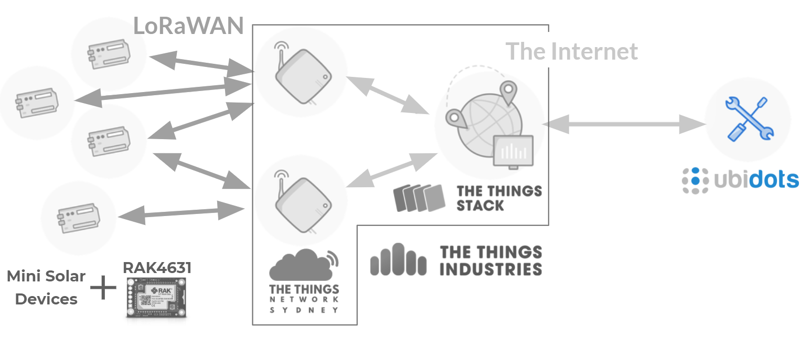

## Overview

[Ubidots](https://stem.ubidots.com/app/dashboards/) is a low-code data storage and visualisation platform that makes dashboard creation simple with a range of built-in widgets. Data is stored for each device in variables that store time-stamped values with associated metadata - ‘dots’. The dots can then be displayed on and downloaded via Dashboards composed of widgets that display data from the device(s) over the selected time range. Data can enter Ubidots through generic webhooks, or pre-defined plugins. It either needs to be formatted to match Ubidots specifications, or can enter semi-raw and be transformed by [Plugin Decoders](./PayloadDecoder/)/UbiFunctions that run short NodeJS or Python scripts.

A Ubidots STEM account has been created for the email: minisolarunsw@gmail.com
At this stage two devices and dashboards that have been created and populated with dummy data as examples for how Ubidots could be used in the Mini Solar project:

- **Mini Solar Device Demo Dashboard**: that displays some dummy sensor data, including temperature, humidity, and pressure for each device.
- **Device Status Demo Dashboard**: that displays some dummy status data for the device(s), including battery voltage, signal strength, and gateway information that can be used to monitor the health of the devices separately from the data collected.

These dashboard links can be viewed without logging in. The time range and selected device can be changed in the top right of the dashboard, however data will only show for the default device and it is not downloadable - you need to log in as the user to access these features.

### Dataflow

_(Please see the diagram below.)_

Sensor data will enter Ubidots via [The Things Stack (TTS) Ubidots Plugin](#tts-plugin) and be processed by the [plugin decoder](./PayloadDecoder/). If the device does not yet exist a [TTS type device](#device-types) will be created. The decoded data and any metadata is stored for each device in variables that can then be displayed on and [downloaded from dashboard widgets](#exporting-widget-data).

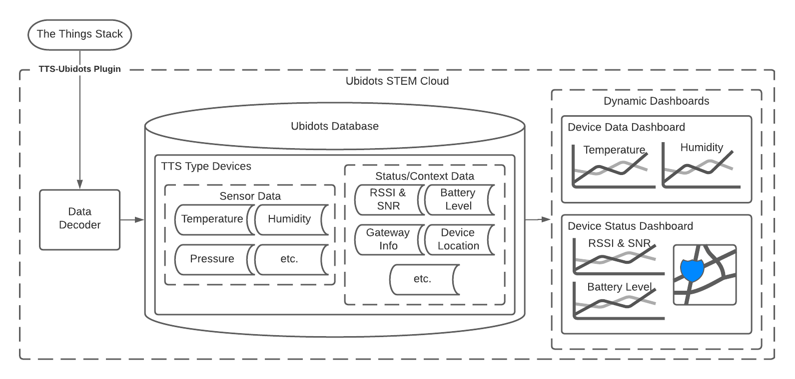

### Ubidots STEM Limitations

Ubidots STEM is the free tier of Ubidots. It includes the basic core elements of the platform (no other users or organisations) with limits on the amount of devices and data that can be stored and accessed by the account:

- _Devices_: 3 (but can be expanded to allow additional devices at $4.5/device/month)
- _Variables per device_: 10
- _Data Intake_: 4000 dots/day & data is only retained for 1 month
- _Data Extraction_: 500,000 dots/day
- _Requests Rate Limit_: 1 / second
- _Dashboards_: up to 3 with 10 widgets each
- _Plugins_: 1 plugin with 10 000 executions / month

## Devices

### Device Types

Types should be used to define groups of devices with the same metadata properties and variables. They are great for device creation, device categorisation/grouping, variable definition (including bulk synthetic variable creation) and ensuring consistency of field naming schema. Consistent formatting and variable API Labels allows dashboards to be dynamic and/or easily duplicated across devices.
Device Types can also be used to refer to sub-select a group of devices by dashboards and some widgets, e.g. Map and device table, to limit the devices displayable by a dashboard/widget.

#### TTS Device Type

The [TTS Plugin](#tts-plugin) creates the TTS device type that all devices processed through the plugin are assigned to. This device type includes two variables that are automatically created upon device creation: F Port & Frame Counter. These variables are not very meaningful and hence are not extracted by the [decoder](./PayloadDecoder/) and go unused, wasting two of the ten variables available per device. Unfortunately as [device types are not technically part of the STEM tier](#ubidots-stem-limitations), the TTS type cannot be editted to prevent automatic creation. They can however be deleted from the device if those two variable slots are needed and they will not be recreated.

### Device Creation

Devices are typically created automatically upon receipt of the first data point by Ubidots (dependent on the integration method), but they can also be created manually through the Devices interface. Manual device creation is only recommended if using the bulk device creation tool and if it is desirable for devices to include additional metadata like a device name (different from the api label), description and property definitions; once the device exists there is no way of bulk uploading this type of data through a CSV or the API.

### Manual Bulk Device Creation

In order to use the Bulk create Devices tool a Device Type must be defined - the TTS Plugin creates a Device Type that can be used.

Go to Devices->Devices, then the top right ‘plus’ symbol and select “Bulk create Devices”:

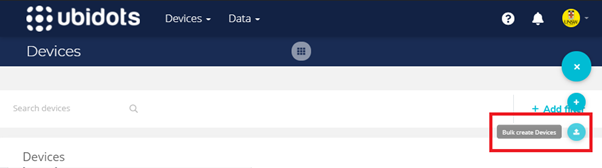

Select the corresponding Device Type, and Download template CSV file:

Fill it out accordingly and reupload.

#### Example tts-device type CSV values:

| Field             | Example                          | Notes                                                                      |
| ----------------- | -------------------------------- | -------------------------------------------------------------------------- |
| Name              | MS Device 1                      | Optional prettier name.                                                    |
| Label             | ms-device-1                      | Device ID set on TTS console.                                              |
| Description       | First Mini Solar LoRaWAN device. | Include any additional descriptive information here.                       |
| Tags              | environmental,sensor             | Optional filtering tags.                                                   |
| "\_lat" & "\_lng" | -33.91722 & 151.22616            | Coordinates of Tyree Building.                                             |
| app_id            | mini-solar-unsw                  | App ID set on the TTS console.                                             |
| dev_eui           | 0x(00 00 00 00 00 00 00 00)      | Unique 64-bit DevEUI of RAK device - can be found by scanning the QR code. |
| dev_addr          |                                  | Ignore this field as it is generated by TTS for each new network session.  |

## Plugins

Plugins are the preferable way to connect apps and services to Ubidots. They customise the device and data ingestion into Ubidots to suit the IOT hardware/application and enable specific automated tasks and user-defined function execution.
The plugins can be found under Devices->Plugins.

### TTS Plugin

The TTS (The Things Stack) plugin allows LoRaWAN end nodes to connect to Ubidots via TTS community networks and server. It can also be used with a regular HTTP POST by following the expected message format. Please refer to [this](https://help.ubidots.com/en/articles/4826310-connect-rak-wireless-wisblock-to-the-things-stack-and-ubidots) article for plugin setup if starting from scratch. You will need to provide the **HTTPs Endpoint URL** & the Ubidots crediental **API Key** to TTS.
This plugin automatically creates devices, assigns them to the TTS [device type](#device-types), and [decodes](./PayloadDecoder/) json and raw-byte data payloads for digestion into Ubidots.

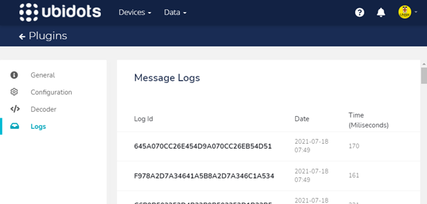

#### LoRaWAN Payload Decoder

The decoder uses a NodeJS script defined under Plugins->The Things Stack->Decoder.
Each uplink payload received by TTS is forwarded to the decoder function that pulls the desired data out of the message and reformats it to match the Ubidots format.
Please refer to the decoder description and code [here](./PayloadDecoder/).

## Dashboards & Widgets

Dashboards and Widgets are the data visualisation tool provided by Ubidots.
See this guide on [Dashboard and Widget Creation](https://help.ubidots.com/en/articles/2400308-create-dashboards-and-widgets) to get started, but the best advice is to dive in.

### Dynamic Dashboards

Dynamic dashboards allow one template dashboard to be created for multiple devices that can then be toggled between with a drop down menu to display each device’s dashboard individually. They are recommended over coping/duplicating dashboards whenever possible.
Dynamic widgets on the dashboard will use the selected devices’ variable API Labels to display each widget hence, consistent variable API Labels are required - this is aided by [device types](#device-types).

### Exporting Widget Data

Widget Data can be exported by going to the three dots next to a widget & selecting download. This is also where the widget can be edited.

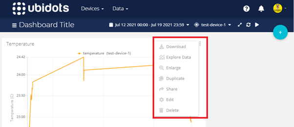

Then enter the email(s) the data will be sent to (choose whatever email is most convenient for you).

_NOTE: Ivan has reported that these emails can fail to come through to unsw.edu.au email addresses (they also didn't appear in spam)._

It may take a few minutes to come through, but you’ll receive an email with a link that will serve the data to you in CSV format. There are [**limits on the number of dots**](#ubidots-stem-limitations) the account can extract each day so keep this in mind and only pull what you need and don’t repeat the request too many times.

### Widget Types

Ubidots has a range of widgets available that can be grouped into a few categories. The best way to familiarise yourself with the widgets is to play with them.

#### Charts

Great for 2D data (e.g. time series data) and plotting data from multiple variables and devices on one graph.

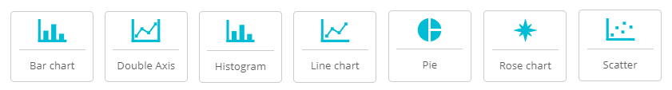

#### Pictographs

Display a single value from a single device on a representative display.
Depending on the chosen aggregation method, the value can be the max, min, count, average or sum over the chosen timespan.

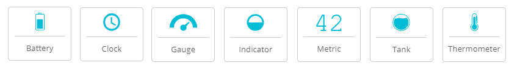

#### Map

Great for displaying the device location along with the variable data. Additionally with a bit of creativity, the location marker can be used with the Custom Colour Logic option to display heat-map style data.
For basic map widget creation start [here](https://help.ubidots.com/en/articles/1712418-create-map-widgets-in-ubidots).

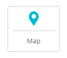

#### Tables

Great for displaying properties or comparing variables of multiple devices.

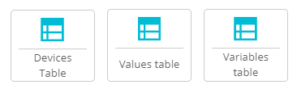

#### Control Switches

The control widgets essentially set the value of a variable. To use that updated variable value as a control, additional setup is required to interpret it. These widgets come under the more advanced umbrella topic of [Control and Automation with Ubidots](https://help.ubidots.com/en/articles/1784986-control-and-automation-with-ubidots), which is beyond the scope of this document.
Some examples include using a [Ubidots Event](https://help.ubidots.com/en/articles/1445537-events-creating-conditional-events-and-alerts) or a [chrome add-on that creates an MQTT Client](https://help.ubidots.com/en/articles/654718-controlling-devices-using-mqtt), that can be triggered by variable changes to send some form of control message to an external service. In a LoRaWAN these require [another layer to actually send that control message](https://help.ubidots.com/en/articles/2687214-events-manage-downlink-messages-with-ttn-and-ubidots) to an end node via LoRa.

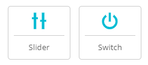

#### Custom Elements

As the name suggests these widgets allow a high degree of customisation of a dashboard and again both are beyond the scope of this document.
The HTML canvas is a great way to create your own [custom widgets](https://help.ubidots.com/en/articles/754634-html-canvas-widget-examples), and the Manual Input allows data/text entry and inputs that can be used for a variety of things (e.g. manual data entry, updating device properties, leaving comments on the dashboard or data, etc.).

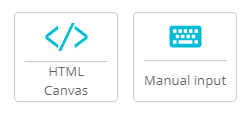

#### Completely Static

These are mostly for aesthetic purposes and can be useful in rounding out the layout/appearance of a dashboard.

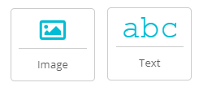
